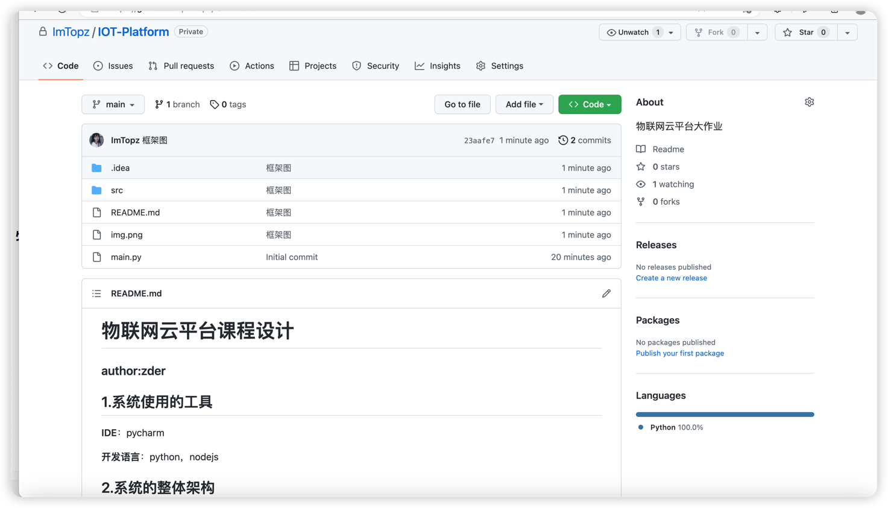
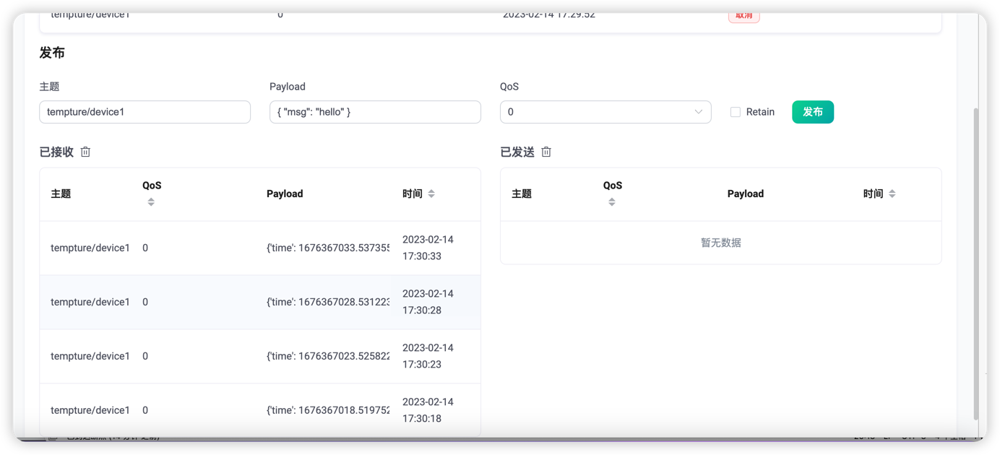
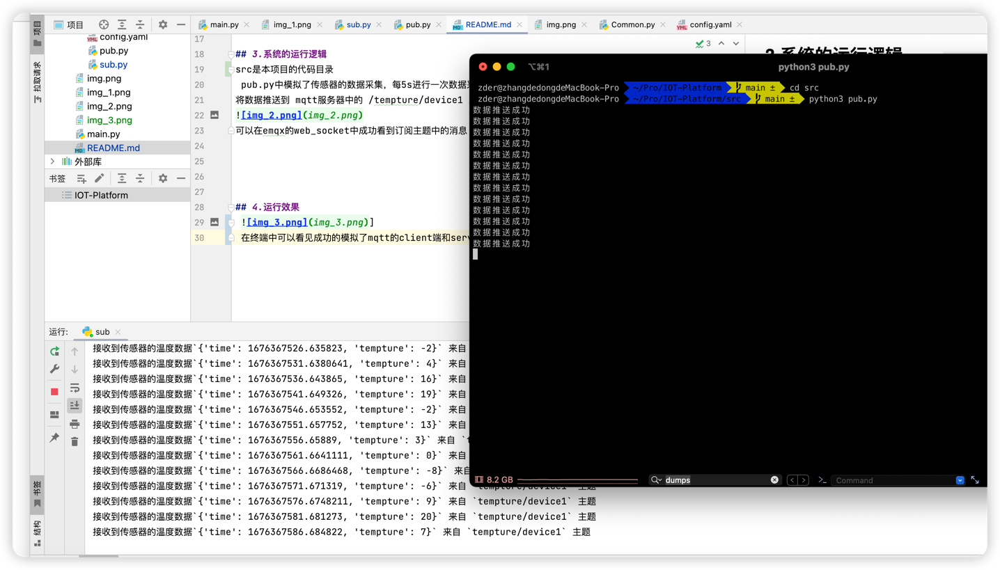
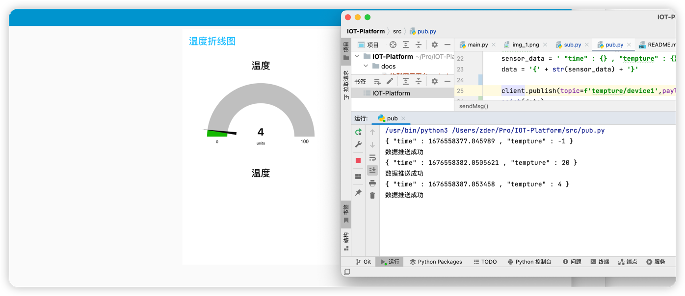

# 物联网云平台课程设计
### author:zder

## 1.系统使用的工具

**IDE**：pycharm

**开发语言**：python，nodejs

**代码管理工具** ：github

## 2.系统的整体架构

## 3.系统的运行逻辑
src是本项目的代码目录
 pub.py中模拟了传感器的数据采集，每5s进行一次数据采集，其中温度数据是通过random进行模拟随机实现
将数据推送到 mqtt服务器中的 /tempture/device1 主题 

可以在emqx的web_socket中成功看到订阅主题中的消息

## 4.运行效果
 
 在终端中可以看见成功的模拟了mqtt的client端和server端，实现了模拟传感器数据的上报 
 

前端采用node-red